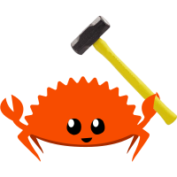

# rust-playground

> Logo provided by Aurorans Solis

The Rust Playground website is great for playing around with a small
idea in Rust, but it's unfortunate that it has to run in the browser
on someone elses machine, subject to rate limiting, slow compile times, 8 second timeouts...

How about instead of using it in the browser, you could use it in your regular editor!

## Example

Use the command to create a new rust playground. Adjust the newly created terminals to your liking. Save the open file and watch it output in the terminal

## Features

* [X] Create a new playground
* [X] Playground Hot reload
* [ ] External Crates support
* [ ] Promote to crate in a permanent directory
* [ ] Switch rust versions for each playground
* [ ] Rust Analyzer support
