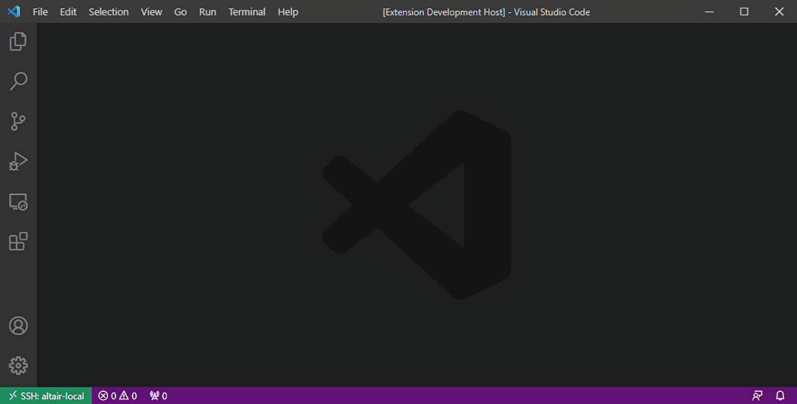

# rust-playground

The Rust Playground website is great for playing around with a small
idea in Rust, but it's unfortunate that it has to run in the browser
on someone elses machine, subject to rate limiting, slow compile times, 8 second timeouts...

How about instead of using it in the browser, you could use it in your regular editor!

## Example

One command will open up a new playground. On the left would be your playground code, on the right is the playground output. When you save the code, you will see the output from the playground on the right hand side automatically update

## Features

* [X] Create a new playground
* [X] Playground Hot reload
* [ ] External Crates support
* [ ] Promote to crate in a permanent directory
* [ ] Switch rust versions for each playground
* [ ] Rust Analyzer support